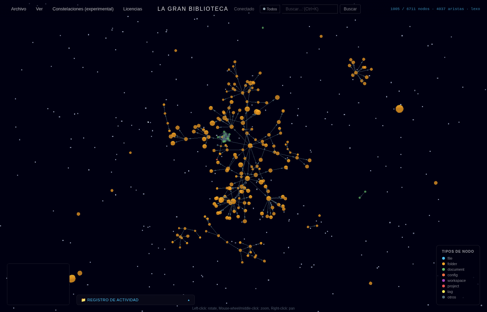
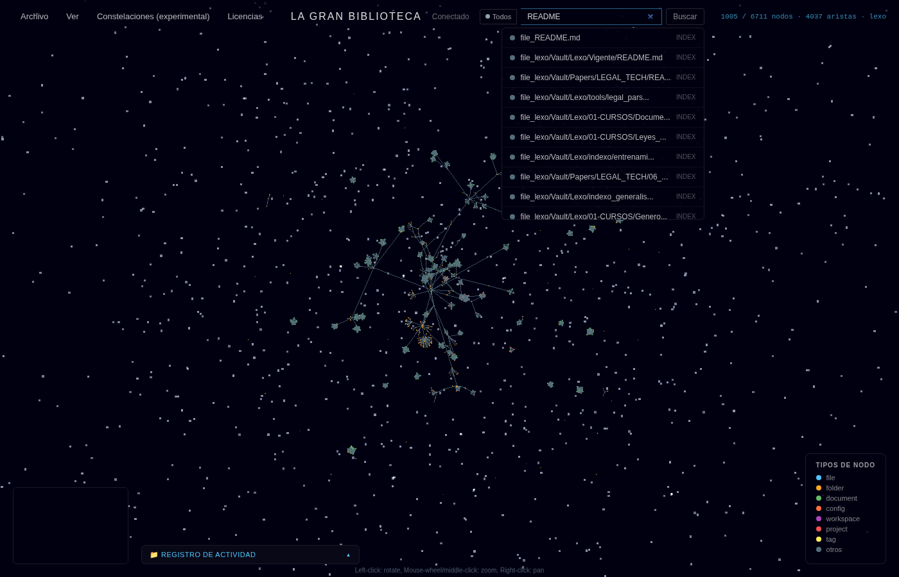
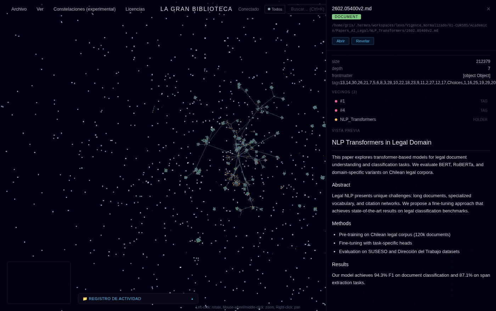

# La Gran Biblioteca

Explora en 3D un mapa de tus notas, documentos y proyectos: cada archivo es un punto y cada enlace entre ellos es una conexión.

[](LICENSE)

## Qué hace

1. **Escanea** una carpeta que tú eliges (tu “bóveda” de conocimiento).
2. **Construye un grafo** a partir de enlaces entre archivos y relaciones detectadas.
3. **Muestra el resultado** en un visor 3D en el navegador; puedes buscar, abrir contenido e importar material externo.

**Capas de lectura (sin sustituir la carga del grafo):** heatmap de volumen/estudio, panel de cobertura colapsable, barra «Vista del agente» sincronizada con MCP (`publish_lens`), y filtros que atenúan nodos fuera del criterio.

Todo corre en tu máquina. No hace falta instalar una base de datos aparte ni subir tus archivos a ningún servicio.

## Capturas


*6.711 nodos, 4.037 aristas — bóveda completa renderizada como constelación 3D*


*Búsqueda de texto en todos los nodos (Ctrl+K)*


*Detalle del nodo: tipo, ruta, metadatos, vecinos y vista previa del markdown*

## Requisitos

- **Python 3.11+** (servidor y escaneo)
- **Node.js 20+** (interfaz en el navegador)
- Una carpeta con tus archivos (Markdown, código, notas, etc.)

Opcional: **Docker** si prefieres no instalar Python y Node en el host.

## Inicio rápido

### 1. Clonar y preparar la bóveda

```bash
git clone <url-del-repositorio>
cd la-gran-biblioteca
mkdir -p ~/knowledge
```

`~/knowledge` es solo un ejemplo; puede ser cualquier ruta con permiso de lectura.

### 2. Configuración (solo la primera vez)

```bash
cp .env.example .env
```

Edita `.env` y define dónde está tu bóveda:

```bash
WORKSPACE_ROOT=~/knowledge
```

El resto de variables en `.env.example` tienen valores por defecto razonables. Si ya tienes un `.env` funcionando, **no lo sobrescribas** con el ejemplo; añade solo las variables nuevas que falten.

### 3. Arrancar servidor e interfaz

En una terminal (raíz del proyecto):

```bash
python -m venv backend/venv
source backend/venv/bin/activate   # Windows: backend\venv\Scripts\activate
pip install -r backend/requirements.txt
python -m backend.library_bridge
```

En otra terminal:

```bash
cd frontend
npm install
npm run dev
```

Abre en el navegador: **http://localhost:5173**

Ahí está el visor 3D. El puerto 3001 es solo la API interna; la interfaz la sirve el proceso de `npm run dev`.

Comprobación rápida:

```bash
curl -s http://127.0.0.1:3001/api/health
```

## Con Docker

```bash
mkdir -p vault
cp .env.example .env
# Opcional: WORKSPACE_ROOT=./vault en .env
docker compose up --build
```

Interfaz en **http://localhost:3000**. La carpeta montada en el contenedor es la que indiques en `WORKSPACE_ROOT` (por defecto `./vault`).

## Estructura del proyecto

```
la-gran-biblioteca/
├── backend/     # Escaneo, grafo y API
├── frontend/    # Visor 3D en el navegador
├── docs/        # Documentación técnica
└── scripts/     # Comprobaciones locales (health.sh)
```

## Configuración habitual

| Variable | Uso |
|----------|-----|
| `WORKSPACE_ROOT` | Carpeta raíz que se escanea (obligatoria en la práctica) |
| `DB_PATH` | Base de datos local del grafo (por defecto `backend/library.db`) |
| `CORS_ORIGINS` | Orígenes del navegador permitidos en desarrollo |

Lista completa y comentarios: [`.env.example`](.env.example).

## Comprobar que todo va bien

Desde la raíz del repositorio:

```bash
bash scripts/health.sh
```

Ejecuta revisión de código, tests del backend y comprobación de tipos del frontend.

## UI, API y MCP

- **Visor 3D** (`npm run dev`, :5173) habla con el **bridge** FastAPI (:3001).
- **Agentes** pueden usar el servidor **MCP** (`python -m backend.mcp_server`) sin levantar el bridge; leen la misma `library.db`.
- Son **dos procesos**: si cambias archivos por la UI o por MCP, el otro lado puede necesitar un **rescan** (botón en la app, `POST /api/rescan`, o tool `rescan()` en MCP) para ver el grafo actualizado. Detalle en [`AGENTS.md`](AGENTS.md#bridge-http-vs-servidor-mcp-dos-procesos).

## Más documentación

| Documento | Para quién |
|-----------|------------|
| [CONTRIBUTING.md](CONTRIBUTING.md) | Contribuir, PRs y entorno de desarrollo |
| [AGENTS.md](AGENTS.md) | Uso con asistentes de IA (MCP) |
| [SECURITY.md](SECURITY.md) | Seguridad y reporte de vulnerabilidades |
| [docs/ARQUITECTURA.md](docs/ARQUITECTURA.md) | Decisiones técnicas (opcional) |
| [CHANGELOG.md](CHANGELOG.md) | Historial de versiones |

## Licencia

MIT — ver [LICENSE](LICENSE).
