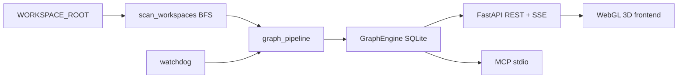

# Arquitectura técnica — La Gran Biblioteca

La Gran Biblioteca es un visualizador y gestor de **grafo de conocimiento** sobre un vault local (`WORKSPACE_ROOT`). Cada archivo/carpeta escaneado es un **nodo**; wikilinks, jerarquía y dependencias son **aristas**.

Para el contexto RepoCiv / Hermes (plano de conocimiento vs workshop), ver [`ecosystem-hermes.md`](ecosystem-hermes.md).

---

## Vista general

| Capa | Tecnología | Rol |
|------|------------|-----|
| Escaneo | Python BFS | Nodos/aristas desde el filesystem |
| Persistencia | SQLite (`DB_PATH`) | Grafo + prefs de constelaciones |
| API | FastAPI :3001 | REST, SSE, imports |
| Agentes | MCP (`backend/mcp_server.py`) | Mismas operaciones sin HTTP |
| UI | Vite + Three.js + 3d-force-graph :5173 | Grafo 3D, panel de detalle |

**No** usa React ni Neo4j.

---

## Backend

### Pipeline de grafo

`backend/services/graph_pipeline.py` unifica el flujo para HTTP y MCP:

1. `scan_workspaces` — recorrido BFS con límites (`SCAN_MAX_FILES`, `SCAN_MAX_CHILDREN`)
2. Merge de imports recientes (`graph_state`)
3. Layout de constelaciones (`constellation_layout.py`) según prefs en SQLite
4. `GraphEngine.build_graph` / `rebuild_graph` — persistencia transaccional

### GraphEngine

- Tablas: `nodes`, `edges`, `constellation_prefs`
- WAL SQLite; backup `.db.bak` en rebuild
- `update_node_metadata` para contadores (`study_count`) vía API `/api/study`

### API (`backend/api/`)

Routers modulares montados en `library_bridge.py`: `graph`, `nodes`, `constellation`, `create`, `imports_api`, `overview`.

Estado en memoria: `graph_state` (grafo actual, cap de respuesta, imports recientes). Singleton `app_deps.engine`.

### Vault hygiene

En `backend/scan/walker.py`:

- Exclusiones técnicas: `.git`, `node_modules`, `.hermes`, etc. + `LGB_EXTRA_EXCLUDE_DIRS`
- Carpetas `archive`, `backups`, `snapshots` según `LGB_ARCHIVE_POLICY` (`exclude` | `shadow` | `include`)
- Overview: `skipped_archive_dirs` en el último escaneo

### Seguridad

- `WORKSPACE_ROOT` como frontera; validación en `path_utils`
- `LGB_API_KEY` opcional en mutaciones
- `LGB_PRODUCTION` enmascara errores 500
- Previews Markdown/código vía DOMPurify en frontend

### Eventos

`workspace_watcher` (watchdog) → cola asyncio con coalescencia ~500 ms → `force_graph_update` → SSE `/api/stream`.

---

## Frontend

- `Graph3DEngine.ts` — escena WebGL, fuerzas 3D, LOD, carga progresiva
- `lib/bridge.ts` / `lib/api/*` — cliente HTTP + SSE
- `constellationService.ts` + UI de prefs — islas por constelación IA88
- Sin framework de componentes; módulos TS planos

---

## MCP

`python -m backend.mcp_server` expone tools alineadas con la API (`overview`, `search`, `get_node`, `read_node`, imports, etc.). No requiere que el bridge HTTP esté activo.

---

## Despliegue local

- Desarrollo: backend + `npm run dev` (proxy `/api` → `127.0.0.1:3001` en WSL)
- Docker: `WORKSPACE_ROOT` montado en `/workspaces`; DB en volumen `lgb-data`
- Export estático: `backend/export_html.py`

---

## Evolución (fases históricas)

1. **Grafo 2D / grilla** — layout plano para exploración rápida
2. **Grafo 3D actual** — mismo JSON de grafo, proyección `(x,y,z)` y constelaciones

La API de grafo permanece estable entre fases de UI.
