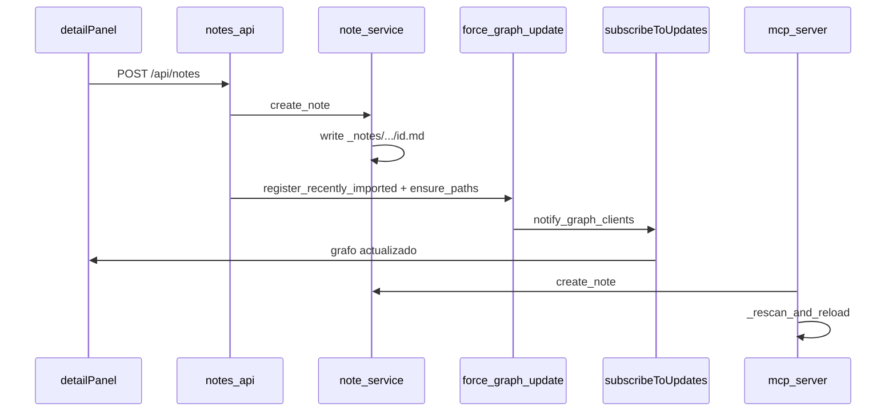

# Plan: Editor de notas integrado en node-detail (Opción B)

**Estado:** Aprobado para ejecución  
**Fecha:** 2026-05-27 (actualizado 2026-05-28)  
**Branch objetivo:** `master`

---

## Objetivo

Agregar un editor de notas minimalista dentro del panel `node-detail` (sidebar derecha). El usuario selecciona texto del preview de un nodo → crea una nota → la nota se guarda como archivo `.md` en el vault → aparece como nodo en el grafo, conectado al nodo fuente vía wikilink.

**No es:** TipTap, toolbar extendida, WYSIWYG.  
**Sí es:** textarea markdown, título, labels como chips, guardado como nodo `note`.

---

## Arquitectura (post-refresh)

| Tema | Decisión |
|------|----------|
| Router HTTP | [`backend/library_bridge.py`](../backend/library_bridge.py) — `include_router(notes_router)` |
| Seguridad | `"/api/notes"` en `MUTATING_PREFIXES` / `RATE_LIMITED_PREFIXES` en [`backend/security.py`](../backend/security.py) |
| Paths | `validate_path_under_workspace()` en [`backend/path_utils.py`](../backend/path_utils.py); `create.py` delega aquí |
| IDs de nodo | `file_<rel_posix>` / `folder_<rel>` — **no** `doc:abc123` |
| Disco | `{WORKSPACE_ROOT}/_notes/{source_slug}/{note_id}.md` — `source_slug = node_id.replace("/", "__")` (truncado); frontmatter guarda `source_node_id` literal |
| Wikilink | `[[stem]]` del archivo fuente (`Path(node["path"]).stem`) |
| Escáner | `get_node_type`: `"_notes" in rel.parts` y `.md` → `"note"` |
| Rescan HTTP | `register_recently_imported` + `asyncio.create_task(force_graph_update(ensure_paths=[note_path]))` (como imports) |
| UI refresh | SSE (`subscribeToUpdates`) — **no** `triggerRescan()` en guardado |
| MCP | Tools **síncronos** (`def`); mutaciones → `_rescan_and_reload()` — **no** `await force_graph_update` (grafo MCP ≠ bridge) |



---

## Flujo de usuario

1. Click en nodo → preview en panel derecho  
2. Seleccionar texto → popup «📝 Nota»  
3. Click → editor bajo preview (cita + título + labels + cuerpo)  
4. Guardar → `POST /api/notes` → archivo en `_notes/`  
5. Toast → colapsar editor → nodo `note` aparece por SSE  

---

## Backend

### `backend/services/note_service.py`

- CRUD: create, read, update, delete, list_by_source  
- `note_id`: primeros 8 caracteres de `uuid4()`  
- Frontmatter YAML + body; wikilink `[[stem]]` al final  
- Validación labels: máx. 10, regex `^[a-z][a-z0-9_-]{0,29}$`, body máx. 50000  

### `backend/api/notes_api.py`

```
POST   /api/notes
GET    /api/notes/{id}
PATCH  /api/notes/{id}
DELETE /api/notes/{id}
GET    /api/notes?source={source_node_id}
```

Tras mutaciones HTTP: patrón imports (véase arriba).

### Tests

- `backend/tests/test_notes_api.py` — endpoints + validación labels  
- Scanner: `get_node_type` bajo `_notes/` → `"note"`  
- `backend/tests/test_mcp_server.py` — create/list/delete note  

---

## Frontend

| Archivo | Rol |
|---------|-----|
| `frontend/src/lib/api/types.ts` | `Note`, `CreateNoteRequest`, … |
| `frontend/src/lib/api/notes.ts` | Cliente REST |
| `frontend/src/lib/bridge.ts` | Re-export |
| `frontend/src/ui/noteCreator.ts` | Popup en selección (C7 cleanup) |
| `frontend/src/ui/noteEditor.ts` | Formulario (C6 draft, C9 labels) |
| `frontend/src/ui/detailPanel.ts` | Integración tras `renderPreview` |
| `frontend/index.html` | `#node-detail-notes` después de preview |
| `frontend/src/styles/panels.css` | Estilos nota |

Toast: `showToast` de `setupDetailPanel` (`#info-msg`).  
`NON_FILE_TYPES`: folder, workspace, project — sin editor.

---

## MCP

```python
@mcp.tool()
def create_note(...) -> dict:  # note_service + _rescan_and_reload

@mcp.tool()
def list_notes(source_node_id: str) -> dict:

@mcp.tool()
def delete_note(note_id: str) -> dict:
```

`list_notes` es lectura; sin rescan. Tras mutación MCP, el agente puede llamar `rescan()` si hace falta alinear con sesión larga.

---

## Criterios de aceptación

- [ ] Popup en selección; editor con chips y cita  
- [ ] Archivo en `_notes/{source_slug}/{note_id}.md`  
- [ ] Nodo `note` en grafo tras SSE (no depender de `triggerRescan`)  
- [ ] Edge vía `[[stem]]` al nodo fuente (`file_...` real)  
- [ ] MCP create/list/delete + rescan inline en mutaciones  

---

## Veredicto

- [x] Aprobado para ejecución  
- [x] Opción A: `_notes/{source_slug}/{note_id}.md`  
- [x] Correcciones C1–C10 incorporadas (C8 revertido: MCP sync + `_rescan_and_reload`)
